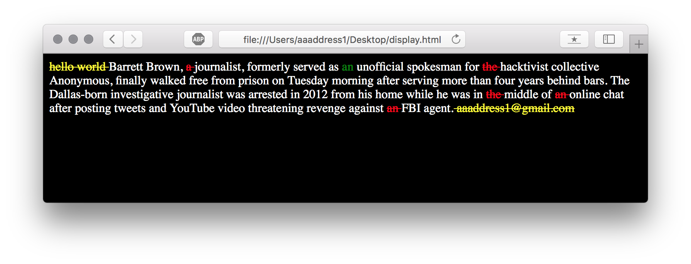

#Fill-In-Diff.js
This project written in Javascript and based on [kpdecker/jsdiff](https://github.com/kpdecker/jsdiff). 

If you wanna build up a website for student to have an English Article fill-in exam online, this project will help you diff between user input and the correct answer.

##Usage

1. sample.txt (Correct Answer Document)
> Barrett Brown, a journalist, formerly served as an unofficial spokesman for the hacktivist collective Anonymous, finally walked free from prison on Tuesday morning after serving more than four years behind bars.
The Dallas-born investigative journalist was arrested in 2012 from his home while he was in the middle of an online chat after posting tweets and YouTube video threatening revenge against an FBI agent.

2. Exam.txt (Questions)
> Barrett Brown, journalist, formerly served as unofficial spokesman for hacktivist collective Anonymous, finally walked free from prison on Tuesday morning after serving more than four years behind bars.
The Dallas-born investigative journalist was arrested in 2012 from his home while he was in middle of online chat after posting tweets and YouTube video threatening revenge against FBI agent.

3. UsrAns.txt
> hello world Barrett Brown, journalist, formerly served as an unofficial spokesman for hacktivist collective Anonymous, finally walked free from prison on Tuesday morning after serving more than four years behind bars.
The Dallas-born investigative journalist was arrested in 2012 from his home while he was in middle of online chat after posting tweets and YouTube video threatening revenge against FBI agent. aaaddress1@gmail.com

4. Your Code (Javascript)
<code>
src = fs.readFileSync('./sample.txt','utf8');

usr = fs.readFileSync('./usrAns.txt','utf8');

lack= getPlantExamText(src);

fs.writeFileSync('./Exam.txt',lack, 'utf8');

diffExam(src, lack, usr,function(htmlOut) {
  fs.writeFile('./display.html', htmlOut);
});
</code>

5. display.html

##Connect with me
Send email to aaaddress1@gmail.com or talk on [ facebook](https://www.facebook.com/aaaddress1)
